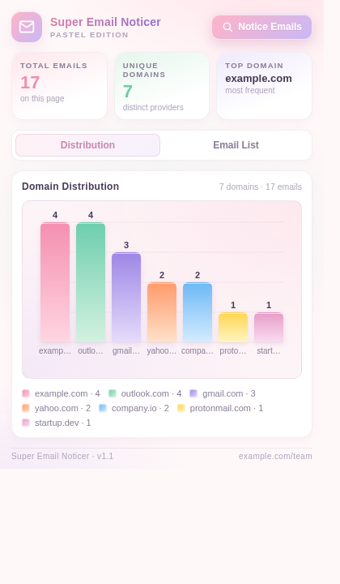
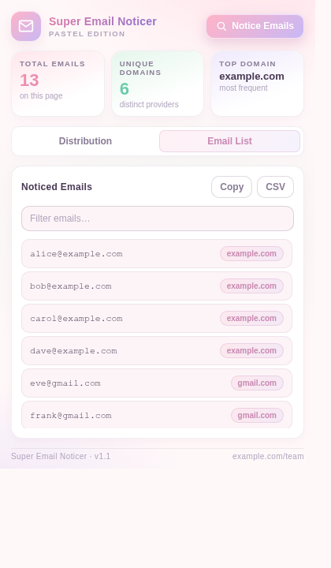

# Super Email Noticer

A friendly, pastel-themed Chrome extension (Manifest V3) that **notices email addresses** on the current webpage and visualises them in a soft, colourful graph.


## Screenshots

| Distribution graph | Email list |
|---|---|
|  |  |

## Features

- **One-click notice** — extracts emails from visible text, raw HTML, and `mailto:` links across all frames
- **Pastel graph** — custom canvas bar chart with a six-tone pastel palette (pink, mint, lilac, peach, sky, lemon)
- **Email list** — searchable, filterable list with click-to-copy
- **Export** — copy all emails to clipboard or download as CSV
- **Soft pastel UI** — cream surfaces, gentle shadows, friendly typography
- **Persistent state** — remembers your last scan via `chrome.storage.local`
- **Privacy-first** — everything stays in your browser; no network requests

## Installation (Developer Mode)

1. Clone or download this repository:
   ```bash
   git clone https://github.com/mrjkilcoyne-lgtm/super-email-noticer.git
   ```
2. Open Chrome and navigate to `chrome://extensions/`.
3. Toggle **Developer mode** (top-right) to **ON**.
4. Click **Load unpacked**.
5. Select the cloned folder.
6. Pin **Super Email Noticer** from the toolbar puzzle icon.

## Usage

1. Navigate to any webpage that contains email addresses.
2. Click the **Super Email Noticer** icon in the toolbar.
3. Click **Notice Emails**.
4. Switch between the **Distribution** (graph) and **Email List** tabs.
5. Use **Copy** or **CSV** to export, or click any email in the list to copy it individually.

## File Structure

```
super-email-noticer/
├── manifest.json      # Manifest V3 configuration
├── background.js      # Service worker
├── content.js         # Injected scanner that finds email addresses
├── popup.html         # Popup UI structure
├── popup.css          # Pastel styling (pink ↔ lilac accents)
├── popup.js           # Popup logic and custom canvas chart
├── icons/             # Pastel envelope icons (16, 32, 48, 128)
├── docs/              # README screenshots
├── LICENSE            # MIT License
└── README.md
```

## Notes

- Some pages (`chrome://`, the Chrome Web Store, etc.) cannot be scanned by browser policy.
- The regex matches standard `local@domain.tld` addresses; obfuscated formats (`name [at] domain [dot] com`) are not detected.

## License

[MIT](LICENSE) © 2026 mrjkilcoyne-lgtm
